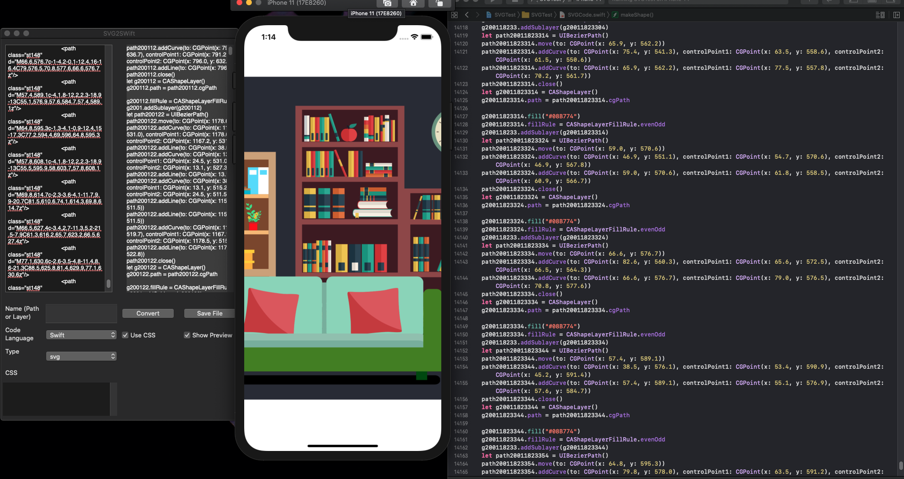
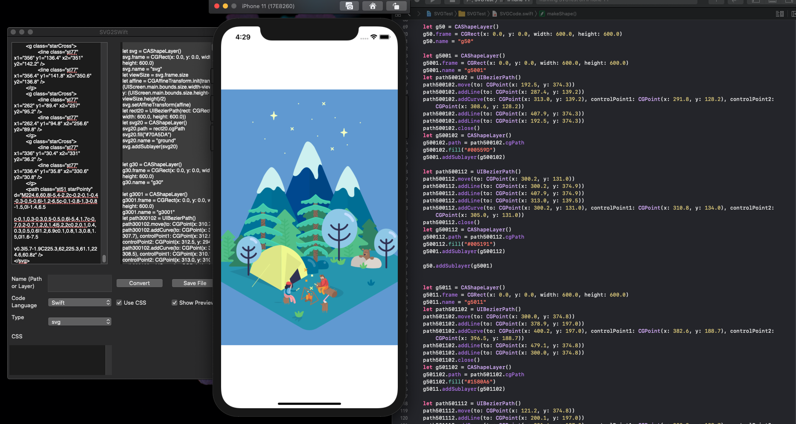

# SvgToCode

Hello there! I’m **SVGToCode**, the open source Code Generater for OS X. 

Let me introduce myself.

## SVG and I

### What is SVG ?

Scalable Vector Graphics (SVG) is an XML-based markup language for describing two-dimensional vector graphics. SVG is essentially to graphics what HTML is to text.

SVG is similar to Adobe's proprietary Flash technology, but it is a text-based open Web standard instead of a closed binary format. It is explicitly designed to work with other web standards such as CSS, DOM, and SMIL.

### What is SVGToCode ?

`-` **SVGToCode** is an OS X software. It will help you generate the readable source code then you can modify base on purpose of your project.

`-` **SVGToCode** is compatible with SVG file export from **Adobe Illustrator** :

# License

`-` **SvgToCode** is released under the MIT license. [See LICENSE](https://github.com/wxxsw/Refresh/blob/master/LICENSE) for details.

`-` Love **SvgToCode** ? Please consider donating to sustain our activities ? Please consider [donating](https://www.paypal.me/lequang1988) to sustain my activities.

