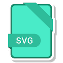
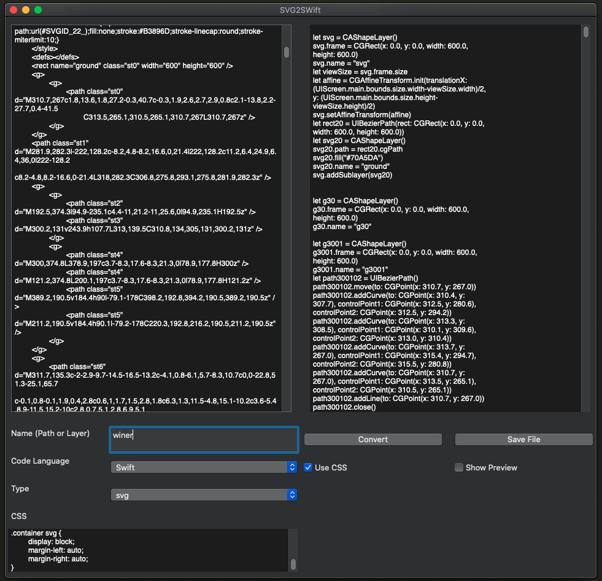

# SvgToCode

Hello there! I’m **SVGToCode**, the open source Code Generater for OS X. 

Let me introduce myself.

## SVG and I

### What is SVG ?

Scalable Vector Graphics (SVG) is an XML-based markup language for describing two-dimensional vector graphics. SVG is essentially to graphics what HTML is to text.

SVG is similar to Adobe's proprietary Flash technology, but it is a text-based open Web standard instead of a closed binary format. It is explicitly designed to work with other web standards such as CSS, DOM, and SMIL.

### What is SVGToCode ?

**SVGToCode** is an OS X software. It will help you generate the readable source code then you can modify base on purpose of your project.

